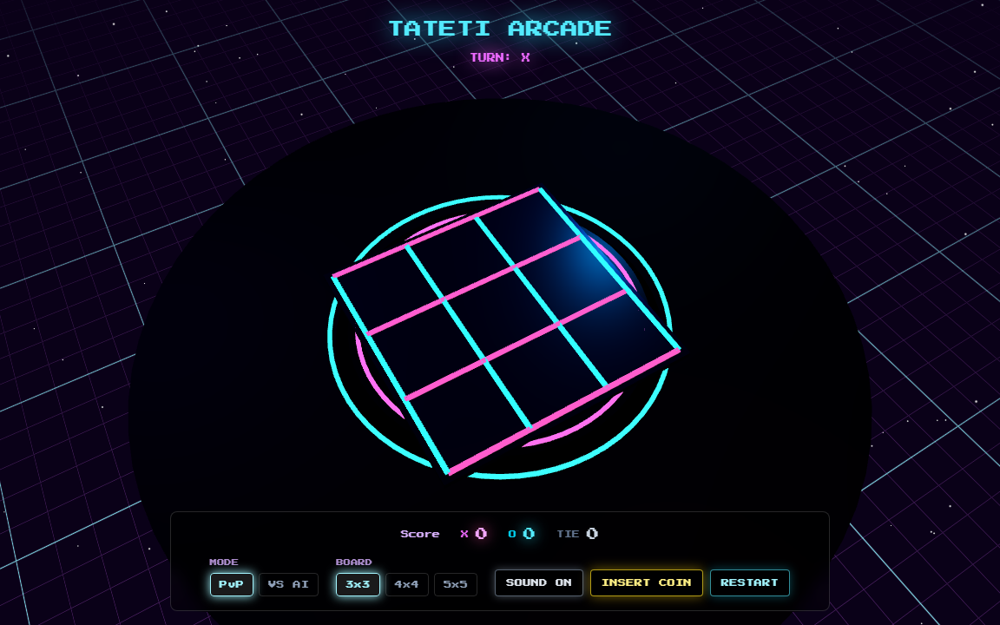
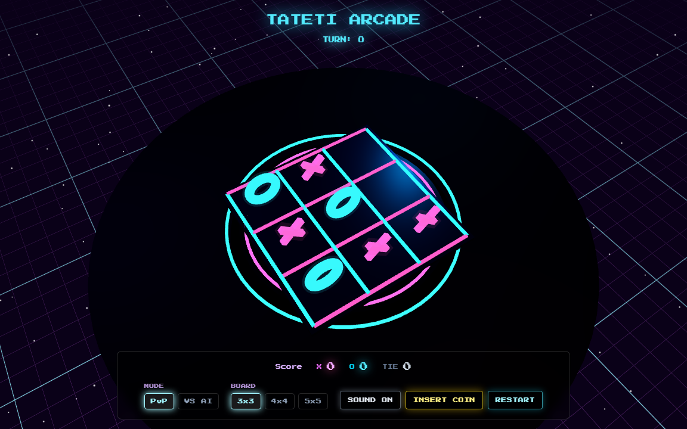
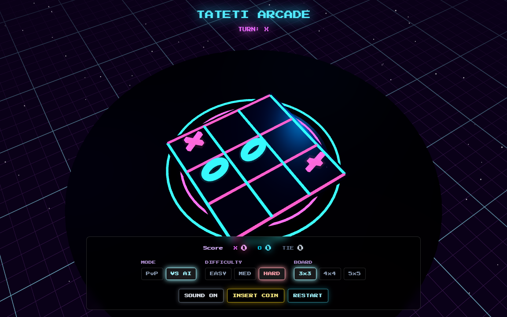
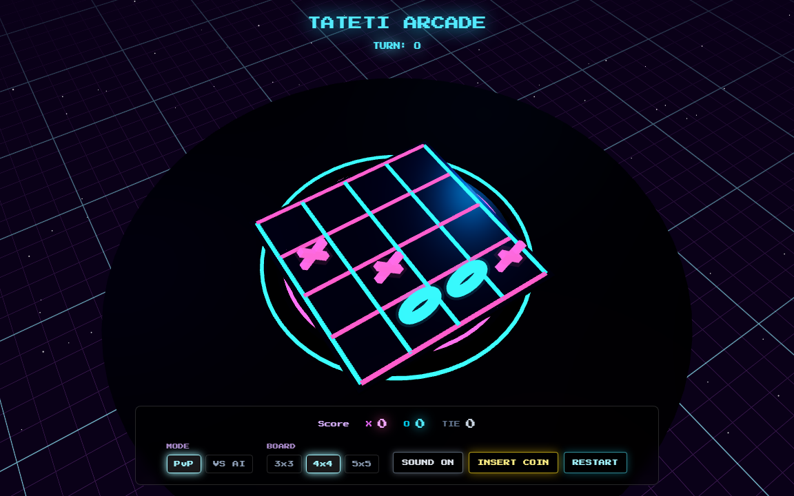
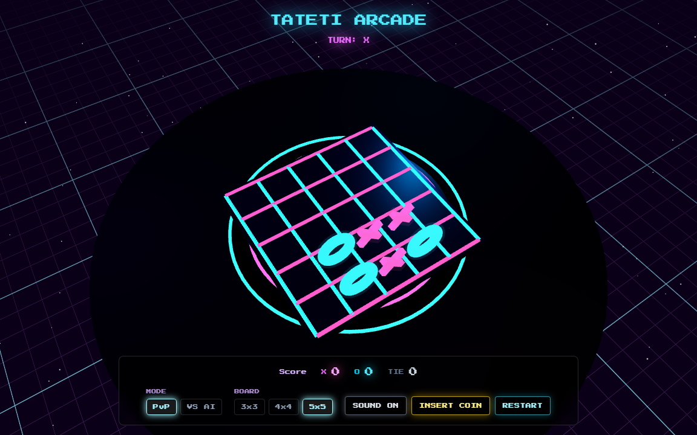
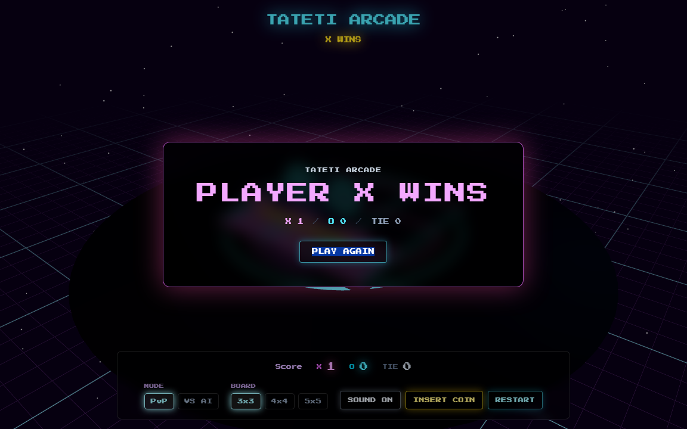
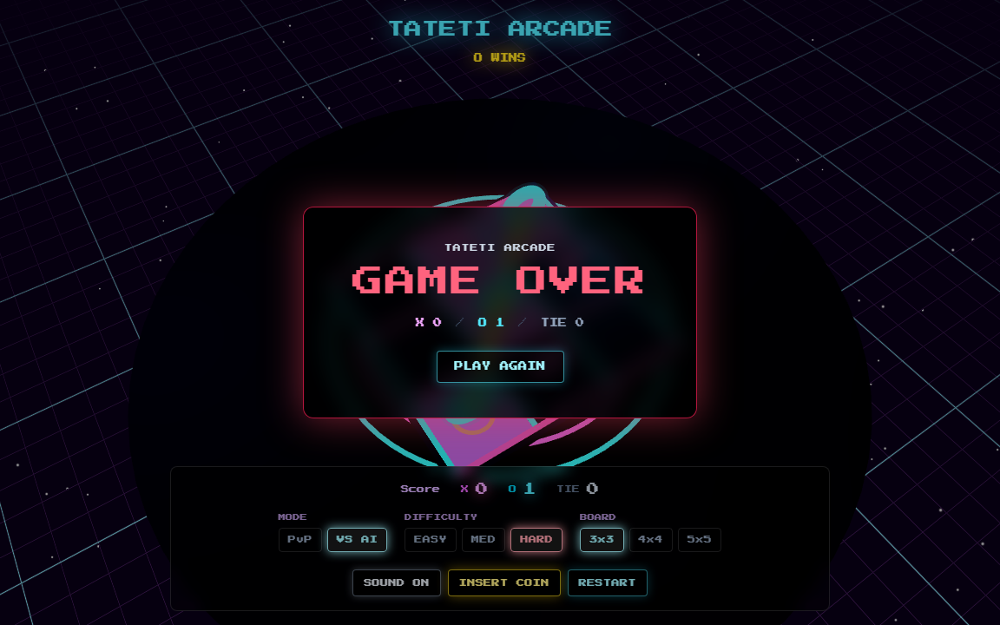

# 🕹️ Tateti Arcade 3D

**Tres en Raya (Tic-Tac-Toe) arcade retro en 3D** con múltiples tableros, IA con dificultades y estética de sala de juegos: neón, scanlines, bloom y sintetizador retro.

> **Demo en vivo:** https://nacholedesma33.github.io/tateti-game/

## ✨ Funcionalidades

| | |
|---|---|
| 🎮 **Tableros dinámicos** | 3x3 (alinea 3) · 4x4 (alinea 4) · 5x5 (alinea 5) |
| 🤖 **Modo VS IA** | Fácil (aleatorio) · Medio · Difícil (Minimax + poda alfa-beta con límite de profundidad para tableros grandes) |
| 👥 **PvP local** | Dos jugadores en el mismo dispositivo |
| 🏆 **Marcador persistente** | X / O / Empates guardados en `localStorage` (resetea con INSERT COIN) |
| 📣 **Carteles de resultado** | PLAYER X WINS · PLAYER O WINS · GAME OVER · DRAW, con botón PLAY AGAIN |
| 🔇 **Control de sonido** | Toggle SOUND ON/OFF (se persiste) |
| 🎨 **Escena 3D arcade** | Plataforma de neón, líneas de grilla cian/fucsia, fichas 3D animadas (pop-in) y línea ganadora luminosa |
| 🎛️ **FX visuales** | Bloom, aberración cromática, scanlines, noise y vignette (postprocessing) |
| 🔊 **Audio sintetizado** | Web Audio API: colocar ficha, hover, victoria/derrota, moneda y ambiente drone + blips pentatónicos |
| ♿ **Accesibilidad** | Respeta `prefers-reduced-motion` |
| ⚡ **Rendimiento** | Code-splitting de three.js en chunk separado |

## 📸 Capturas

*Tomadas con tests E2E automatizados (Playwright) — ver [E2E-TESTS.md](./E2E-TESTS.md).*

### Tablero inicial 3x3


### Partida a mitad — 3x3


### VS IA — dificultad Difícil


### Tablero 4x4


### Tablero 5x5


### Cartel de victoria


### GAME OVER (gana la IA)


## 🚀 Cómo jugar

1. Elegí **Modo** (`PvP` o `VS AI`), **dificultad** (si jugás contra la IA) y **tamaño de tablero** (`3x3` / `4x4` / `5x5`).
2. Hacé **clic en una celda** del tablero 3D para colocar tu ficha. El fantasma translúcido te muestra dónde va.
3. Rotá la cámara arrastrando para ver la escena desde otro ángulo (zoom con rueda).
4. **Alinea** 3, 4 o 5 fichas (según el tablero) para ganar. El cartel muestra el resultado y podés jugar otra ronda.
5. `INSERT COIN` resetea el marcador; `RESTART` reinicia la partida.

## 🛠️ Stack

Vite 8 · React 19 · React Three Fiber 9 · drei · postprocessing · three.js · TailwindCSS 4 · oxlint · Playwright

## 💻 Desarrollo

```bash
npm install       # instalar dependencias (incluye Chromium de Playwright con: npx playwright install chromium)
npm run dev       # servidor de desarrollo
npm run lint      # oxlint
npm run build     # build de producción
npm run preview   # previsualizar build
npm run test:e2e  # tests E2E + capturas de pantalla (Playwright)
```

> 💡 Los tests E2E cargan la app con `?nofx` (desactiva postprocessing/sombras para acelerar la render en headless). Las capturas de la galería se regeneran automáticamente al correr `npm run test:e2e`.

## 📦 Despliegue

### GitHub Pages

El repo incluye un workflow (`.github/workflows/deploy.yml`) que compila y publica en GitHub Pages en cada push a `main`.

1. En GitHub: **Settings → Pages → Source: "GitHub Actions"**.
2. Push a `main` (o dispara el workflow manualmente desde la pestaña Actions).
3. La app queda en `https://<usuario>.github.io/tateti-game/`.

### Vercel

1. Importa el repositorio en https://vercel.com/new.
2. Framework preset: **Vite**. Build command: `npm run build`. Output: `dist`.
3. Deploy automático en cada push.

> Nota: si el build necesita un base path distinto (subruta), usar `VITE_BASE_PATH=/tu/ruta/`.
